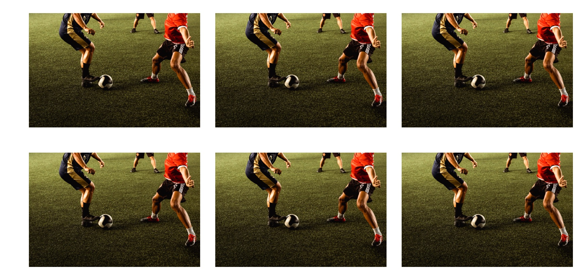

# Afan Valley Fitness

You can find the live link here: [Afan Valley Fitness](https://lewisjones37.github.io/afan-valley-fitness/)

A responsive website showcases Afan Valley Fitness' excerice facilities 

## Table of Contents

- [User Experience](#user-experience)
  - [Initial Discussion](#initial-discussion)
  - [User Stories](#user-stories)
- [Design](#design)
  - [Colour Scheme](#colour-scheme)
  - [Fonts](#fonts)
  - [Structure](#structure)
  - [Imagery](#imagery)
  - [Wireframes](#wireframes)
- [Features](#features)
  - [Future Implementations](#future-implementations)
  - [Accessibility](#accessibility)
- [Technologies Used](#technologies-used)
- [Frameworks & Tools](#frameworks--tools)
- [Deployment](#deployment)
  - [Deployment](#deployment)
- [Testing](#testing)
  - [Automated Testing](#automated-testing)
  - [Manual Testing](#manual-testing)
- [Credits](#credits)

## User Experience

### Initial Discussion

This project gives a local gym a platform on the internet. The gym has a goal of genrating more interest and income, and a website is an essential tool that can make that happen. This will give the gym more exposure to as it can be accessed on mobile devices, tablets, laptops and computers. The goals from the offset are to look profesional, have all key information that can be easily visible on the website, showcase all the facilities. And make sure the gym is easily contactable and loacatable 

### User Stories
- As a user, I want to be able to simply navigate the page.
- As a user, I want to be able to read and understand the topic of the website.
- As a user, I want to be able to understand the offering.
- As a user, I want to be able to sign up to the gym.
- As a user, I want to be able to have an overview of the facilities and staff.
- As a user, I want to be able to find the gym
- As a user, I want to be able to follow the gym on social media

#### Client goals 
- To provide basic information about Afan Valley FItness
- Adopt the look of a modern social friendly gym through graphic design.
- Provide a sign up form.
- provide a booking form.

#### First Time visitor goals
- Book inductions through call back form, contact number, email or contact via social media.
- Find out how to get to Afan Valley Fitness 
- See images of facilities and euiptment availble.
- Get to know the staff.

#### Returning Visitor goals
- Easily see changes in opening times.
- Easy way to contact or connect to gym's social media.

#### Frequent Visitor goals
- Refer friends and family to the website.

## Design
- The website is a multiple page design and seperates all key information into seperate pages. The aesthetics of the Website are minimalistic, It utilises a hero image on the home page and gives the Website a welcoming feeling. The website uses simple forms to make the user experience as starightforward as possible.

### Colour Scheme

- I chose a blue color scheme for this gym website as requested by the Gym as it matches the company logo and the general theme inside the actual gym. I also beleives it conveys a sense of trust, reliability, and calmness. Blue is often associated with stability and dependability, which are important qualities for a gym to convey to potential customers. Using different shades of blue adds depth and variety to the color palette, while still maintaining a cohesive look. The light background, mostly white, creates a clean and airy feel that is both visually appealing and easy to read. Overall, this color scheme helps create a sense of professionalism and competence, which can encourage potential customers to trust the gym and take action towards their fitness goals.
IMAGE HERE OF COLOR PALLETE

### Fonts

 - I chose to use the Roboto font from Google Fonts for my website for several reasons. Firstly, its clean and modern design gives my site a professional and polished look, which is important for creating a positive user experience. Additionally, its well-defined letterforms and balanced proportions make it easy to read, ensuring that my content is accessible to my audience. Finally, the wide range of font weights and styles offered by Roboto allows me to customize my typography to suit my site's needs, giving me more flexibility in creating a unique and cohesive visual identity. Overall, I believe that Roboto is an excellent choice for anyone looking for a stylish, readable, and versatile font for their website.

### Structure 

- The page is structured in a well know, recognizable, user friendly, and easy to learn way. Upon arriving to the website the user sees a familiar type of navigation bar with the gym logo on the left side and the navigation links to the right. The website consists of five separate pages:

- A homepage with a sections for our story, open times and location.
- An gallery page with images of the facilities.
- A meet the staff page, with images and a quote from staff members.
- A sign up page with a form for a call to book an induction as requested by the gym.
- A booking facilites page with a differently desgined form to book facilities.

### Imagery

#### Hero Image 
- A light hero image of fitness activty highlights the modern style of the gym.

#### Staff Images 
- Using images of staff on the website can make the gym staff feel more approachable and welcoming, as it gives users a sense of the people behind the project. It can also help to reduce the stress or anxiety that readers may feel when signing up, as they are more likely to feel like they are interacting with real people rather than a faceless entity.

#### Background image of booking facitlity page.
- using an image of people participating in sports gives a more professional sense. GIving customers peiece of mind when booking and paying for faciltites 

### Wireframes

Home

Gallery

Meet the Staff

Sign Up

Book our Facilities

###

## Features

### Logo and Navigation Bar 

- Featured on all five pages
- The navbar is fully responsive and changes to a toggler (hamburger menu) on smaller screens and includes links to the Homepage, About page, Menu page, Gallery and Contact us page
- It allows users to easily navigate the page.
- When the mouse is hovering a line appears underneath and dissapeares when gone.
- Clicking gyms logo navigates back to home page.

### Homepage Hero image  

- Zooms in on entry of page.
- Intorduces user to page with instant impression of health and fitness.

### Our Story 

- Gives the user history of the gym. 

### Opening Times  

- Gives the user knowledge of opening times through the week

### Location  

- Shows a Google map location of gym.
- GIves end user a thorough explanation of the location of the gym using one image.
- Interactive, gives the user ability to zoom in and out.

### Footer 

- Has links to both social media acconts of the gym.
- WHen hovered over, both links turn blue colour to match the style of the website.

### Gallery Hero

- Logo as focal point of page.
- Aligns with minimilstic aesthetics of website 
- informative message below logo.

### Gallery Grid Display

- Showcases all images in a grid before selecting one to zoom in.
- SHows customer range of equiptment. 
- Simple and easy to see what's on offer.

### Gallery selected image

- Zooms in and gives full view of image.
- Easy transition in and out of selected image.
- Gives description bottom left hand corner of the image.

### Meet our Staff Hero

- Variantion in styling to differ from other pages.
- Consistent in colour.
- Bold heading with icon to draw user attention.

### Meet our Staff images

- Individual images of staff.
- In a circle border to vary styling of website.

### Staff profiles

- Provides profile of staff.
- Makes staff who haven't signed up yet a bit more familiar to the staff.

### Sign up heading

- Different background color to vary style of website.
- Bold title to let users know what page they are using and page purpose.

### Sign up Form

- Gym logo at the top center to give professional look.
- Has only the necessary information on the form to avoid over complication for the user.

### Booking page heading

- Consistent in the style of the website.
- Followes style of Gallery heading to maintain aesthetic.

### Booking Form

- Adds a different style to bottom of the page to add varation.
- Background image of two people in action using facilities.
- Only requires necessary information from user to book facilities.
- Color gradient on image consistent with color pallete of website.

### Future Implementations

- As I gain more skills I would like to add a member portal in future updates

### Accessibility

A description of the efforts made to ensure the project is accessible to all users goes here.

## Technologies Used

### Lanuages 
- HTML 
- CSS

## Frameworks & Tools
- Bootstrap v5.3.0
- GitHub
- Gitpod
- Google Fonts
- Font Awesome 
- Easy Tutorials 

## Deployment

#### Deploying the Website with GitHub Pages

- The website was deployed using GitHub Pages by following these steps:

1. In the GitHub repository navigate to the Settings tab.
2. On the left-hand menu select Pages.
3. For the source select Branch: master.
4. After the webpage refreshes automatically, you will see a ribbon on the top saying: "Your site is published at INSERT LINK HERE

- You can fork the repository by following these steps:

1. Go to the GitHub repository.
2. Click on the Fork button in the upper right-hand corner.
3. Cloning the Repository

- You can clone the repository by following these steps:
1. Go to the GitHub repository.
2. Locate the Code button above the list of files and click it.
3. Select if you prefer to clone using HTTPS, SSH, or Github CLI and click the copy button to copy the URL to your clipboard.
4. Open Git Bash.
5. Change the current working directory to the one where you want the cloned directory.
6. Type git clone and paste the URL from the clipboard ($ git clone https://github.com/YOUR-USERNAME/YOUR-REPOSITORY).
7. Press Enter to create your local clone.

## Testing

#### Responsiveness

- The Website is fully on responsive on mobile and tablet.
- I have used screenshot's of Chrome developer tools using iPhone 5 & iPad Air below to evidence. 

#### iPhone 5

- Homepage 

- Gallery

- Meet the Staff

- Sign Up

- Book our Facilities 

#### iPad Air

- Homepage 

- Gallery 

- Meet the Staff 

- Sign up 

- Book our Facilities 

### Browser Compatibility 

| Browser | Version | Compatibility |
|---------|---------|---------------|
| Chrome  | latest  | Good      |
| Edge    | latest  | Good      |
| Firefox | latest  | Good      |

- Note: "latest" refers to the most recent version available at the time of writing.

### Bugs 

- Problem
1. The toggle bar would not open in smaller devices.
2. User could not toggle through website at ease.

- Solution
1. Researched bootstrap.
2. Realised I was not putting in script on all pages.

### Performance

Google Lighthouse in Google Chrome Developer Tools was used to test the performance of the website.

Home

Gallery

Meet the Staff

Sign Up

Book our Facilities

### Code Validation

- HTML 

1. Hompage

2. Gallery

3.  Meet the Staff 

4.  Sign up 

5. Book Our Facilities 

- CSS

- The W3C Jigsaw CSS Validation Service was used to validate the CSS of the website. When validating the page as a whole, the validator shows some errors linked to Bootstrap v5.0. When validating just my own custom CSS it passes with no errors found and some warnings associated to using root variables.

1. Whole Page 

2. style.css

## Credits

A list of the people and resources used to create the project goes here.
